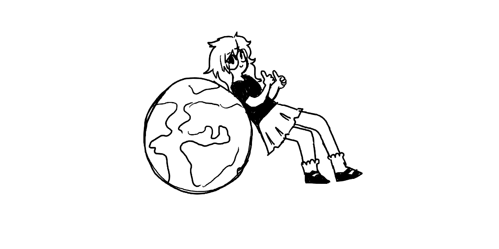

# Finding Fulfillment

This year or maybe these last 2 years or so, I have been grappling with the question; "what am I going to do with my life? ". This terrifying question, I'm sure, is in the minds of most 20 something year olds who are feeling lost or demotivated. I created this document to reflect on my thoughts from the past few years, what I believe is important to me, resources I have consumed to help me, and what I plan on doing in the near future.

I will mainly comment on finding "meaning" and "fulfillment", how important money is to me, and what kind of work I want to do.

# The meaning of fulfillment

First, as all things go, we should probably start with defining some of the terminology.

:::{topic} Definition
According to the [cambridge dictionary](https://dictionary.cambridge.org/dictionary/english/fulfillment), fulfillment is a feeling of happiness because you are doing what you intended to do in life.
:::

This is such an interesting defintion because of the use of "intended". Does this imply every person has some *intention* in this world? Again, to "intend" to do something means to have as a plan or purpose. This furthers the implication that I, as a person, have some purpose in my life and if I do this purpose, then I will find happiness and *fulfillment*.

# Reflecting

The next section will summarise my own experience working and studying, and how all this has shaped my current thinking.

## I was looking for a job and then I found a job

Ever since graduating from my Bachelor of Science, my desire and wants for my life have changed drastically. I first realised that I may not like coding as much as I hoped and instead enjoyed data analyses more, i.e. extracting information from data and doing something intentional when learning about this information. Thus, I went on my long journey of trying to find a job in 2023.

Lets take a look at the statistics. I was a graduate with a major in physics and a minor in computer science, applying to jobs like software development, software engineering, and data analysis. Keep in mind I also had a bunch of engineering units under my belt due to a temporary change in my degree. I had created a well-rounded resume with all the skills I have developed, my experience as a university tutor and all the projects I worked in the last few years.

So how many jobs did I apply to? Below is a graph summarising the number of jobs I applied to and how many responded back. This was over a 4 month period, with my first application being on 11th of December 2022.

:::{include} applications-pie.html
:::

Alright, so around 80% of jobs dd not bother replying to me. This was usually accompanied by an email from seek stating that my application is likely not to progress. Then, after 4 months of continuous applications, I get two offers, one was a casual job that would transition into full time and the other was a full time position. For the sake of security, I chose the latter.

## and heaven knows I'm miserable now [^song]

I was excited, mostly for the paycheck, but also for finally finding something that fit my skills. Data analysis was something I was actually passionate about and even though the field that I was working in wasn't something I expected, I was still keen to apply everything I have learnt.

The first big hit that I sustained was the commute. It was one hour there and back; driving to my train station, taking the train and then walking to the office. Every day, 5 days a week. At this time, it was also winter, so I would leave the office in darkness and get home already ready to sleep.

The work itself was mostly alright, save for the use of Excel (will speak on this later), it was comfortable and not too challenging or easy. I had great coworkers who were incredibely supportive and I enjoyed my time in the office. Hanging out with friends after work was still possible, but I found myself exhausted during social situations since I would have spent 10 hours at my desk during the day.

Then came the anxiety. I have been struggling with some sort of anxiety disorder since I was a teenager. From what I know, it was triggered from an incredible stressful period in high school where I would be on the verge of panic attacks mutliple times a week. Ever since then, I have had it under control. Yet, when I started my full time job, it all came crashing down again. It started with feelings of neausa which I would experience after eating or when going to dinner with friends. Then, it started seeping into my office time. The worst was when I felt so nauseous I took a break outside and then could not get myself to stand up because my body was so full of anxiety. I cried that day. I lost track of how many times I cried after work. It is safe to say my mental health was at an all time low.

## Maybe I should follow my passion...

I thought maybe instead I should follow my passion. I left work after 5 months (embarrassing) and instead decided to apply for a Master of Science, majoring in physics. Physics was always something I enjoyed ever since high school and I have always considered doing research because I love stimulating my mind and learning about new things. So, instead of taking the corporate way of life, I enrolled at university. Since then, I completed one semester and absolutely loved going to lectures, speaking to others about physics, and learning about many new things. But then came the realisation; maybe I'm not as good at physics as I thought I was. As much I enjoyed class, when it came time to do assignments and test, I was really stumped. It was definitely not because I wasn't studying; I don't think I was ever as immersed in a university semester as I was back then but something just wasn't clicking. Exam season broke me. I was devestated, having spent hours and hours studying and working as hard as I thought I could, only to actually fail one of my subjects.

Now I was really lost.

# Are most jobs useless now?

I think a concept I was mildly interested in when I was considering what I truly wanted to do with my life is how many jobs are actually good and fulfilling. This means how many jobs are useful to both society and the people working. There's been the phenomena of "useless jobs" that has been visited by researchers. It first began with an article from David Graeber called [On the Phenomenon of Bullshit Jobs: A Work Rant](https://strikemag.org/bullshit-jobs/). I highly recommend giving this article a quick read because it might challenge your view on many jobs that currently exist in our society. tl;dr we thought through the innovations in technology, we would automate many jobs and would collectively work less hours. It would make sense with capitalism since we want to increase profit and make our businesses more efficient. Yet, instead, we seem to be working more and working in higher positions. It seems counter-intuitive. Graeber argues that these jobs that we are creating are "bullshit jobs" that are pointless and add no meaning to our society. These are jobs that exist to appease some higher up management. This article has been ruthlessly tested again and again by researchers but the interesting thing about this particular article is the subjectivity of "useful". In the original article, Graeber claims that only the employee themselves could assess whether their work is useful; this was the only way since determining if a job is objectively useful to society is difficult. This means when conducting research, the question that employees asked will likely impact their answer.

A [recent study by Simon Walo (2023)](https://journals.sagepub.com/doi/10.1177/09500170231175771) again attempted to investigate whether bullshit jobs were real and asked participants in the U.S. two questions: "how often their work provides them with *the feeling of making a positive impact on [their] community and society*" and "how often it provides them with *the feeling of doing useful work*". I believe this wording is the best because it explicitely asks pariticpants whether they are doing impact on society as a whole, rather than the subjectivity of doing "useful work", which they also ask. According to the results, jobs in "education, training, and library" has the least useless jobs. This makes sense because they directly help people become better versions of themselves. Libraries are specifically designed to cater to the local community and are not for profit. "Healthcare" was also considered one of the most useful jobs and it makes logical sense. Interestingly, only around 24% of employees in computer related jobs believe their job is useless. Sales was highly useless along side office and admin. These last few proclaimed to be the "bullshit jobs"; and there seems to be some truth to it. This paper also investigated the correlation between aspects of the job and what could make it feel useless. They showed there is some correlation between useless jobs and routine work. However, jobs that have autonomy tend to feel less useless. I believe this is all important for us to reflect on the type of work we should seek out to feel more impactful; to feel connected to the world we live in and the people around us. I think this is vital.

Remember the Excel comment I made earlier? I believe this relates to a deeper issue with current jobs. We are still stuck in the industrial 9-5 work hours. Back then, the 40 hour work week was revolutionary; it cut back many hours of labour that was impacting peoples lives. But now? What is the point of being in an office for 8 hours a day when most of the work we do can be done in a couple of hours? How many jokes have you seen of people explaining how they pretend to do work at their desk because they finished their tasks hours ago? A [study](https://www.vouchercloud.com/better-living/office-worker-productivity) in the UK actually polled this and found that workers only averaged around 2 hours and 53 minutes of work a day. How crazy is that. At work, I made a comment about the use of Excel and how outdated it is, especially for the use of large data sets. However, I was told this was the way it's always been and what clients are used to, so we need to stick with it. When will jobs finally transform for the modern era?

# My current outlook

If you asked me a year ago if I cared about having an impact on this world, I would have said "not really, I just want to live my life peacefully". If you asked me the same question again, I would preach about wanting to do work that is important and has meaning. Something has shifted in my thinking and I believe it is due to all the discussions I was having with friends and the literature I was consuming.

I believe one of the most impactful resources I have come across was [80,000 Hours](https://80000hours.org/), a non-profit organistaion helping people find meaningful jobs. They have performed extensive research to find our world's most pressing problems and suggest ways you can help, whether through donations or finding a job that creates a difference. I highly recommend giving their career guide a read because I believe it is filled with lots of wisdom that can have tangible effects on your life. The biggest thing I have learnt that the issues of A.I are a lot more pressing than I expected and perhaps I should use my computer science knowledge and abilities to instead help ensure we use A.I. ethically without potentially destroying our world. Their article on what consistutes the "dream job" was also very helpful since it lays out I believe what a lot of people are thinking but not voicing.

During 2024, I have also started reading The Republic by Plato. This piece recounts Socrates ideas of Justice and the "perfect" society. Although this particular read was more abstract, I believe it was still important to investigate what being a good person is. After completing this, I would like to write another article specifically about it.

So where am I now? After much discussion and reading, I think I have settled on working with A.I. More specifically, I would like to help create policies and make the use of A.I. safer for everyone. I want it to be used to make our lives easier so we can all help the Earth and follow our passions. There is so many issues that could come with A.I. that we are already seeing the effects of and I hope to be able to make some sort of impact. It is one of the most pressing issues of our generation and I believe it is the space where I can lend my hand.

If you read this far, thank you very much! I am still on this journey of self discovery (sounds corny) but my goal in the end is to be happy and give back to the world as best as I can.

[^song]: "heaven knows I'm miserable now" - the smiths

