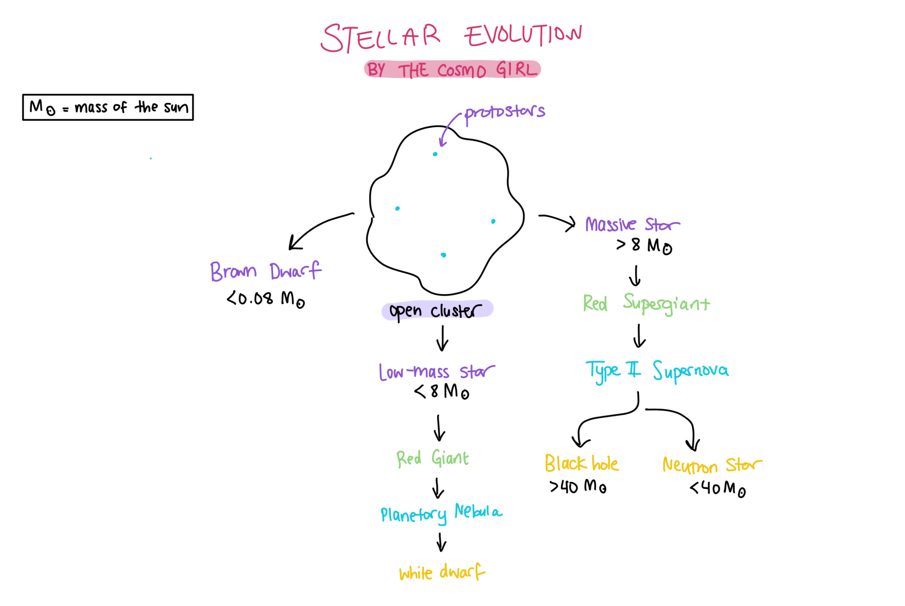
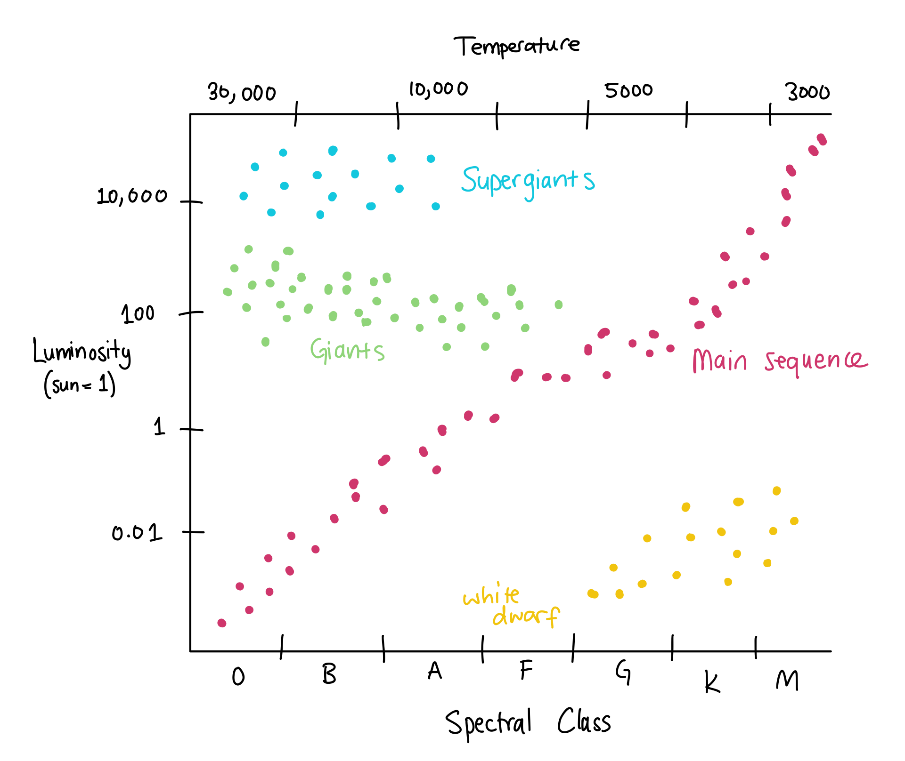

# Stellar Evolution

I have created this page to explain the evolution of a star from birth to death. That’s because I believe it’s an incredibly fascinating topic that is not too difficult to understand and visualize.

Above is an illustration I created showing the basic pathways that a star may traverse during its lifetime. First, it’s important to notice how a star’s life depends entirely on its mass. The heavier the star, the more dramatic its final moments and remnants will be.

Low mass stars, such as our Sun, will live ordinary lives and become red giants. Their final moments are (usually) the shedding of their outer layers in a planetary nebula, leaving behind a white dwarf. More massive stars become red supergiants instead. These stars implode and end their lives with a large type II supernova. Their final form again depends on the mass. They could either leave behind the famously known black hole or a neutron star.

Alright, those are the basics. But what the hell is a red giant? What is a neutron star? We can delve much deeper into star types and what they actually are.

The type of stars mostly depends on their brightness and mass. The Hertzsprung-Russell diagram is the cheat sheet to classify a star. See how clusters of stars in the same region are given the same name? You can see here that a red giant star is less bright and less massive than a red supergiant (to be fair it’s in the name). There are also a lot of main sequence stars. Stars spend most of their lifetime in this category before gaining enough mass to be considered giants! The “empty space” in this diagram simply refers to regions where stars are unlikely to form or do not spend enough time to be have a classification. Perhaps they exist but we have not observed them yet.

Now what about the remnants after the star has died? White dwarfs are the remains of a red giant and are a heavy core that is not very bright. Neutron stars, on the other hand, are so incredibly massive and bright. They can even sometimes spin thousands of times a second, flashing light beams across the galaxy. These are called pulsars. Black holes are an entirely different story. Such stars are so incredibly massive that their gravitational pull no longer allows light to escape, creating “dents” in space-time.

I hope this little post has given you a small insight into the interesting life cycle of a star. However, this is all not set in stone as discoveries are made all the time to make our models much more accurate!